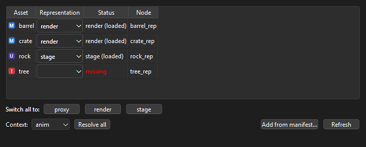
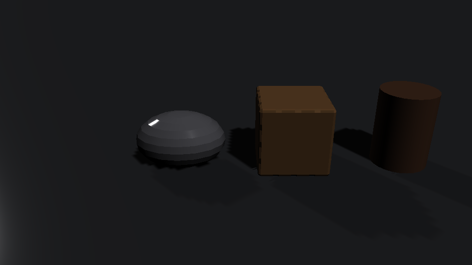
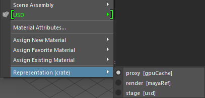
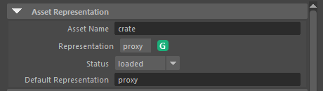
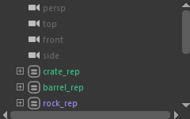

# rep_switch

A Maya plug-in for swapping what an asset shows: a light proxy, an animation
cache, the full render model or a USD stage. Each asset gets one `repAsset`
node, and you switch what's loaded under it from a panel, the right-click
menu, the Attribute Editor or a script.



Big scenes can't have everything at full resolution. Layout wants proxies,
lighting wants the real models, and the farm needs the render versions even
if someone saved the scene in proxy mode. Here that's one line:
`cmds.repSwitch(all=True, context="farm")`.



## Install

Download or clone the repo and drag `install_rep_switch.py` into the Maya
viewport. That loads the plug-in, makes it load on startup, and adds a
RepSwitch button to your shelf. If your Maya doesn't have PyYAML (2027
doesn't) it gets installed into the repo's `deps` folder, which needs
internet the first time. If you move the folder, drag the file in again.

## Using it

Click the RepSwitch shelf button to open the panel, then "Add from
manifest..." to load some assets. Pick a representation per asset from the
dropdowns, use the buttons along the bottom to switch everything at once, or
pick a context (layout, lighting, farm...) and press "Resolve all".

You can also right-click an asset in the viewport:



or use the dropdown in the Attribute Editor:



The badge shows what's loaded: M for a Maya file, A for Alembic, G for a GPU
cache, U for USD, red for missing files. In the Outliner the asset's name
changes color the same way. Maya won't show a different Outliner icon per
node, so color is the next best thing.



Every switch can be undone, whichever way you made it.

## Manifests

A manifest lists an asset's representations. Paths are relative to the
manifest, and the type is worked out from the file extension unless you say
otherwise. It can be JSON or YAML:

```yaml
asset: crate
default: proxy
representations:
  proxy:  {type: gpuCache, path: publish/crate_proxy.abc}
  anim:   {type: alembic,  path: publish/crate_anim.abc}
  render: publish/crate_render.ma
  stage:  publish/crate.usda
```

## Scripting

```python
from maya import cmds
from rep_switch import manifest, maya_scene

for asset in manifest.read_manifest("D:/publish/crate/crate.yaml"):
    maya_scene.create_node(asset)

cmds.repSwitch(asset=["crate"], representation="render")
cmds.repSwitch(all=True, representation="proxy")   # skips assets without a proxy
cmds.repSwitch(all=True, context="farm")
cmds.repSwitch(asset=["crate"], query=True)        # ["proxy"]
```

## Contexts

A context is a list of what to prefer. If the first choice isn't on disk it
tries the next, then the asset's default.

| Context | Tries |
|---|---|
| layout | proxy, gpuCache, usd, render |
| anim | proxy, gpuCache, mayaRef |
| lighting | render, usd, alembic |
| farm | render, alembic, usd, mayaRef |

To use your own, point `REP_SWITCH_RULES` at a JSON or YAML file like
`examples/rules.yaml`. If you call `repSwitch -all` without saying what to
switch to, it uses `REP_SWITCH_CONTEXT`, or "farm" in batch and "layout" in
the UI, so a farm pre-render script can just call `cmds.repSwitch(all=True)`.

## How it works

The node stores the representations as attributes and parents whatever is
loaded under itself, so moving the node moves the asset. Maya files and
Alembic caches come in as references, GPU caches and USD stages as shapes.
Everything a switch creates is connected back to the node, so unloading
removes exactly that.

Deciding what to load is plain Python and doesn't need Maya: it produces a
plan, the Maya side carries it out, and undo runs the plan backwards. The
plug-in uses Maya's Python API 1.0 because custom transform nodes aren't
available in API 2.0.

## Tests

```bash
pip install -e ".[test]"
pytest              # everything that doesn't need Maya
mayapy -m pytest    # also loads the plug-in and switches through all four types
```

## Notes

- Undoing a switch away from a Maya file reloads it, so reference edits made
  in that session are lost.
- The node ids are from Autodesk's range for local plug-ins. Get your own
  block before sharing scenes outside a studio.
